# Interview Assistant

一个面向求职与面试准备的多智能体应用：使用 LangGraph 编排 Main、RAG、Research、Resume 与 Index Agent，通过 React 将普通对话、深度研究、简历修改、人工审批和中断恢复组织成一条自洽的产品时间线。

> 这是一个可在本机完整运行的个人作品项目。它重点展示多智能体编排、Human-in-the-loop、状态持久化与可解释交互，不以公网高并发 SaaS 为目标。

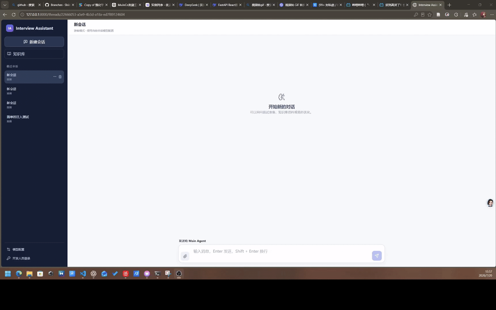

## 核心能力

- **Registry 驱动的多智能体协作**：Main Agent 根据任务调用 RAG、Research 或 Resume 子图；新增子智能体只需增加 wrapper 并登记 registry。
- **可解释的深度研究**：在聊天时间线中展示研究计划、搜索关键词、网页 URL、抓取/提炼进度、报告生成及知识入库审批。
- **Human-in-the-loop 简历修改**：Resume Agent 独立维护草稿，按计划逐条提出修改；用户可以批准、拒绝或反馈建议，源简历永不被直接覆盖。
- **Lapis Markdown 简历工作区**：支持完整源码 Diff 与 Lapis CV 渲染对比，修改前后内容使用不同颜色标记。
- **可恢复的长任务**：LangGraph checkpoint 持久化超级步状态；页面关闭或任务停止后，可从最近检查点继续执行。
- **可靠的审批协议**：每次操作使用 `operation_id`，每个 Interrupt 使用独立稳定的 `interrupt_id`，避免恢复后把旧审批误用于新阶段。
- **独立的产品事件时间线**：产品事件仅供前端展示，不参与 LangGraph 图输入；即使事件写入失败，也不会改变图的业务执行。
- **按用户隔离的数据层**：Thread、简历、个人知识、checkpoint 和长期记忆按 principal 隔离，开发人员可单独管理公共知识。
- **运行时模型配置**：游客在浏览器中配置 Provider、模型和 API Key；密钥只保存在当前标签页，不写入后端数据库、产品事件或 checkpoint。

## 一分钟本机启动

完成一次性安装和前端构建后，在仓库根目录双击：

```text
demo.cmd
```

启动器会检查 `.venv`、前端构建产物和端口，直接使用现有虚拟环境启动单进程 FastAPI；`/health` 就绪后自动打开 `http://127.0.0.1:8000`。在启动窗口按 `Ctrl+C` 即可停止。

也可以从 PowerShell 启动：

```powershell
.\demo.cmd                 # 启动并打开浏览器
.\demo.cmd -NoBrowser      # 不自动打开浏览器
.\demo.cmd -Port 8010      # 使用其他端口
```

推荐现场演示顺序：

1. 普通问答：展示 Main Agent、执行状态和产品事件时间线；
2. RAG 问答：展示知识检索与回答末尾的行级引用；
3. 深度研究：批准计划，观察网页处理进度，最后决定是否入库；
4. 简历优化：上传 Markdown 简历，展示 Agent 交接、全文 Diff 和 Lapis 渲染；
5. 中断恢复：停止一个长任务，再次进入会话并从 checkpoint 恢复；
6. 知识管理：展示公共知识、个人知识及索引状态。

## 功能展示

### 统一的多 Agent 时间线

用户消息固定在右侧，Main、Research、Resume 等 Agent 使用不同头像出现在左侧。执行状态显示在头像旁；工具调用、长任务详情和 Agent 交接按产品事件顺序呈现。Resume Agent 接管任务后，聊天上下文仍在同一时间线上连续展示。

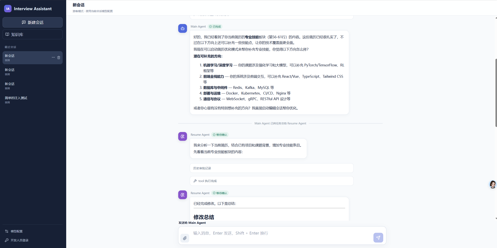

### RAG：检索有据、引用可追溯

RAG Agent 提供语义检索与关键词检索两条独立管道。知识切片在 metadata 中保留 `start_line` / `end_line`；检索结果交给 Main Agent 作为上下文，最终只展示回答实际使用的参考资料，而不是把所有召回结果强行列为引用。

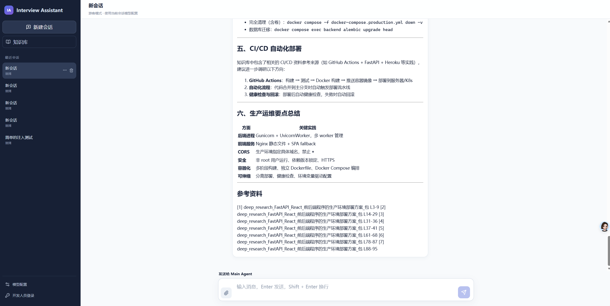

### Research：可观察的深度研究

Research Agent 首先生成研究计划并等待用户确认，随后循环执行查询发现、网页抓取和内容提炼。前端展示当前关键词、正在处理的 URL 与整体进度；报告完成后再次 Interrupt，只有明确批准才导入个人知识库。


### Resume：独立草稿与逐条审批

Main Agent 负责简历资源管理、目标简历选择和任务交接；Resume Agent 负责计划—确认—修改循环。工作区在 Resume Agent 会话期间常驻，并支持：

- 在完整 Markdown 原文上展示源码 Diff；
- 切换 Lapis CV 修改前/修改后渲染效果；
- 对每条修改批准、拒绝或提出建议；
- 在待命状态继续提出新的修改需求；
- 保存为一份新简历，或放弃整个草稿；
- 已批准的草稿修改不可逐条撤销，但永远不会覆盖源简历。

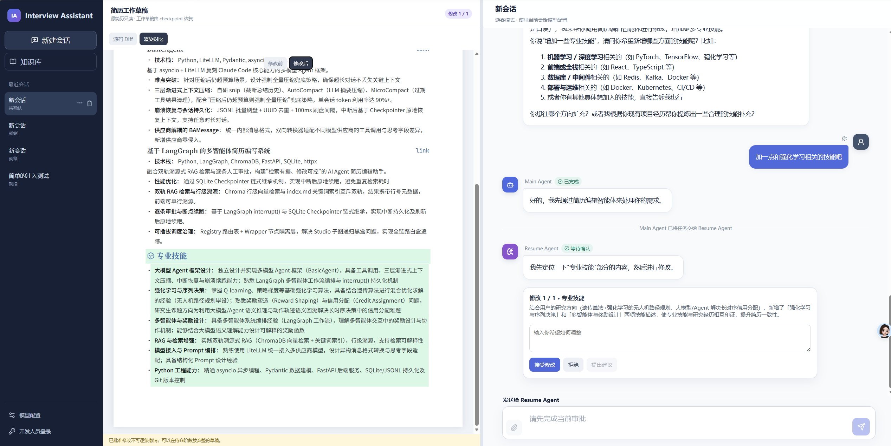

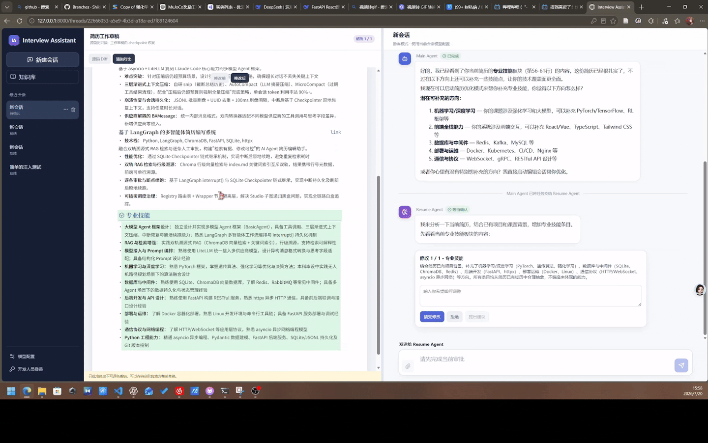

### Checkpoint：中断后恢复

LangGraph checkpoint 决定图从哪里继续，产品事件决定前端展示什么。预期内的审批 Interrupt 不会被标记为异常中断；意外停止或主动取消后，重新进入会话可以从最近 checkpoint 恢复。未完成节点或超级步允许重新执行，对应产品事件允许在时间线中再次出现。

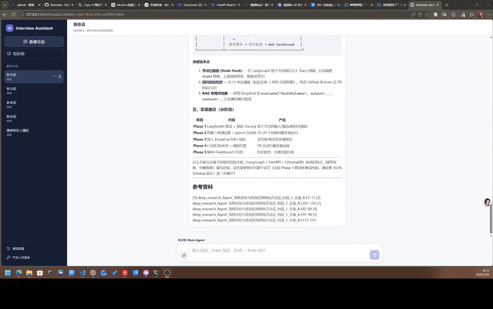

### 公共知识与个人知识

游客只能读取公共知识，开发人员可以上传和删除公共知识；个人知识、深研报告和索引按 principal 隔离。删除知识时同步清理 Markdown 原文、metadata、关键词索引和 Chroma 向量块。

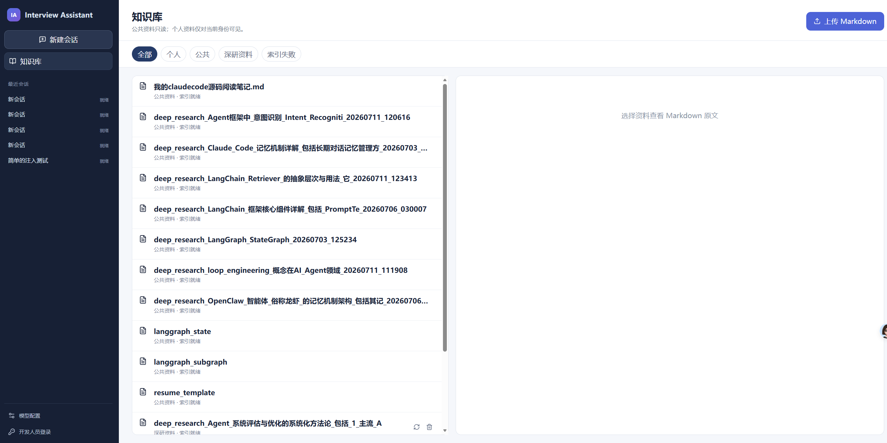

## 系统架构

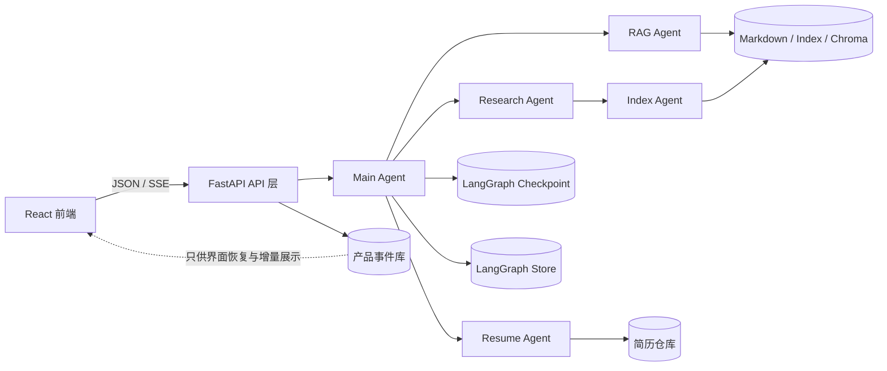

核心职责边界：

- **Checkpoint** 保存图状态，负责中断后的执行恢复；
- **Product Event** 保存用户可见时间线，不作为任何图节点的输入；
- **Main Agent** 负责统一对话、工具选择和子智能体编排；
- **子智能体** 通过 tool schema 接收最小必要交接数据，通过 `ToolMessage` 返回精简结果；
- **Index Agent** 负责 Markdown 导入、关键词索引更新与 Chroma 灌入，不承担对话职责。

## LangGraph 图结构

### Main Agent

子智能体工具通过 `REGISTRY` 注入模型并完成路由。普通工具和子图执行完成后都回到 `chat_node`；模型不再调用工具时进入长期记忆提取节点并结束本轮图执行。

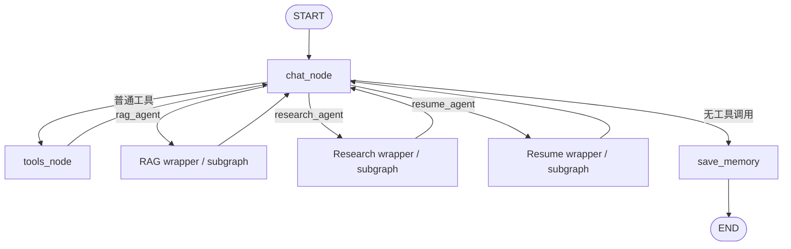

### Research Agent

下图保留当前图的主要循环与 Interrupt。网络连通性异常可以重试或终止；报告生成后，入库确认与研究计划确认使用不同的 `interrupt_id`。

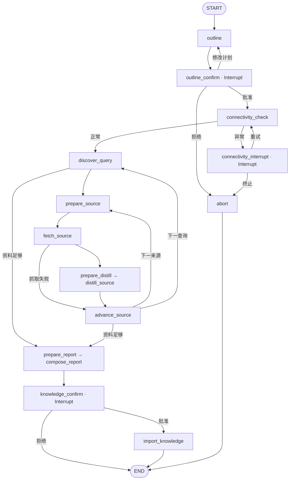

### Resume Agent

Resume Agent 的计划批准由 `plan_confirm` 节点负责，`chat_node` 不重复询问。每条 `grep_replace` 修改在真正写入草稿前进入 `approve_node`；全部处理完毕后进入常驻 `hitl_standby`，用户可以继续修改、保存为新简历或放弃退出。

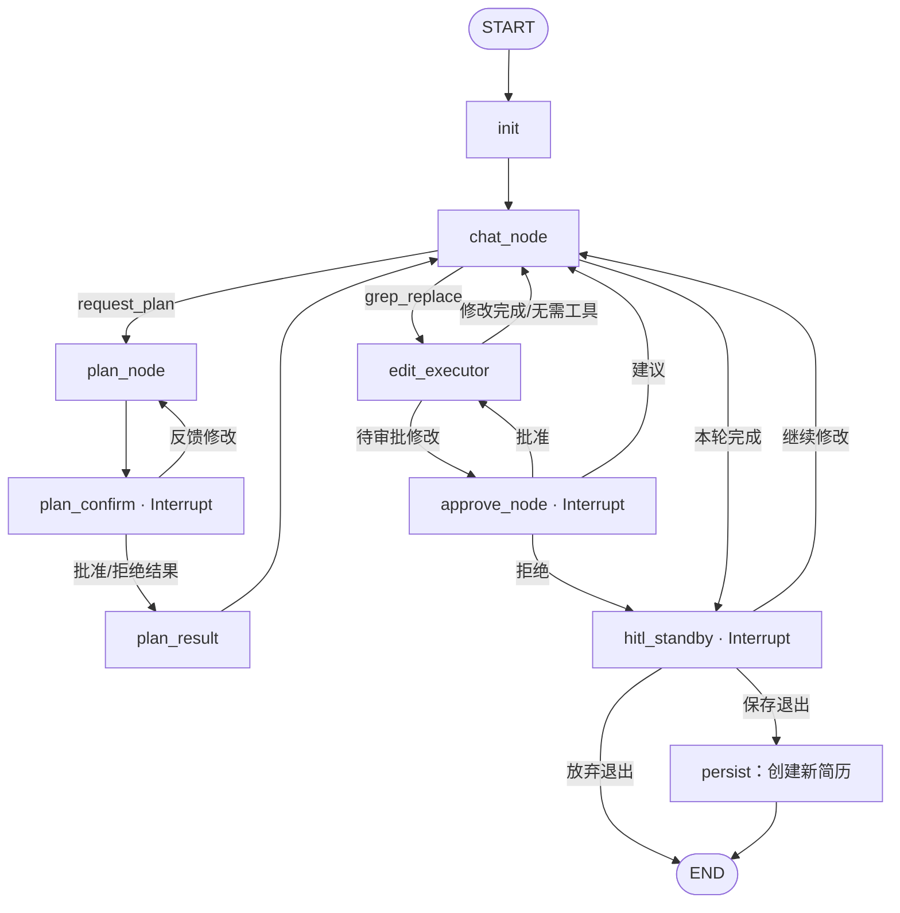

## 技术栈

| 层次 | 技术 |
|---|---|
| Agent 编排 | LangGraph、LangChain、子图 wrapper + registry |
| 模型适配 | `ChatOpenAI`、OpenAI-compatible endpoint、运行时 Provider 预设 |
| 后端 | FastAPI、Pydantic、SSE |
| 前端 | React 19、TypeScript、Vite、React Markdown |
| 持久化 | SQLite Checkpointer、SQLite Store、产品事件与资源数据库 |
| 检索 | Chroma、SiliconFlow Embedding、关键词索引、行级 metadata |
| 简历展示 | Markdown、Lapis CV 样式与字体资源 |

## 首次准备

建议环境：Windows、Python 3.11/3.12、[`uv`](https://docs.astral.sh/uv/)、Node.js 与 npm。

### 1. 安装后端

```powershell
uv venv
uv pip install -r pyproject.toml
```

### 2. 构建前端

```powershell
cd frontend
npm install
npm run build
cd ..
```

只有前端代码变化后才需要重新构建。日常演示直接运行 `demo.cmd`。

### 3. 配置模型

复制 `.env.example` 为 `.env`。游客模式可直接在前端“模型配置”中选择 API 格式、模型名、请求地址并填写 API Key。

本机演示或 LangGraph Studio 调试也可以开启开发人员模式：

```env
DEEPSEEK_API_KEY=...
DEEPSEEK_API_URL=https://api.deepseek.com/v1
IA_DEFAULT_MODEL=deepseek-chat

IA_DEV_MODE=true
IA_DEV_ACCESS_TOKEN=仅本机使用的高熵凭证
IA_COOKIE_SECURE=false
```

开发人员模式直接使用服务端 `.env`。它只适用于本机调试，不应暴露到公网或不可信局域网。

## 开发与验证

后端热重载：

```powershell
uv run uvicorn server.app:app --host 127.0.0.1 --port 8000 --reload
```

LangGraph Studio：

```powershell
uv run langgraph dev
```

检查与测试：

```powershell
uv run ruff check src tests
uv run mypy --strict src
uv run python -m pytest tests/unit_tests

cd frontend
npm run build
```

## 持久化数据

| 路径 | 内容 |
|---|---|
| `data/state/app.sqlite` | 身份、Thread、产品事件、操作账本及资源 metadata |
| `data/state/checkpoints.sqlite` | LangGraph checkpoint |
| `data/state/store.sqlite` | LangGraph 长期记忆 Store |
| `data/markdown/` | 公共知识 Markdown |
| `data/knowledge/` | 按用户隔离的个人知识 |
| `data/chroma/` | 向量数据 |
| `data/index.md` | 关键词检索索引 |

现场演示前建议备份整个 `data/`，并准备一份脱敏简历。不要将 `.env`、API Key、运行日志、用户数据或本地 SQLite 文件提交到 Git。

## 当前边界

- 主要面向桌面 Chrome、Edge 和 Firefox，未专项适配移动端；
- 任务取消表位于进程内，因此当前固定使用单进程/单 worker；
- SQLite、本地 Markdown 与 Chroma 适合个人演示和单实例运行，不适合直接水平扩容；
- 当前采用逐条 `grep_replace` 审批，交互清晰可控，但处理大规模结构调整时仍有优化空间；
- 尚未实现第三方 Skill 安装、生产级限流、日志审计和自动游客数据清理；
- 未来可以利用 LangGraph 时间旅行对同一 checkpoint 运行不同提示词，构建可复现的 Prompt 评测流程。

更详细的需求、阶段设计和数据流报告位于 [`docs/`](docs/)。

## License

[MIT](LICENSE)
