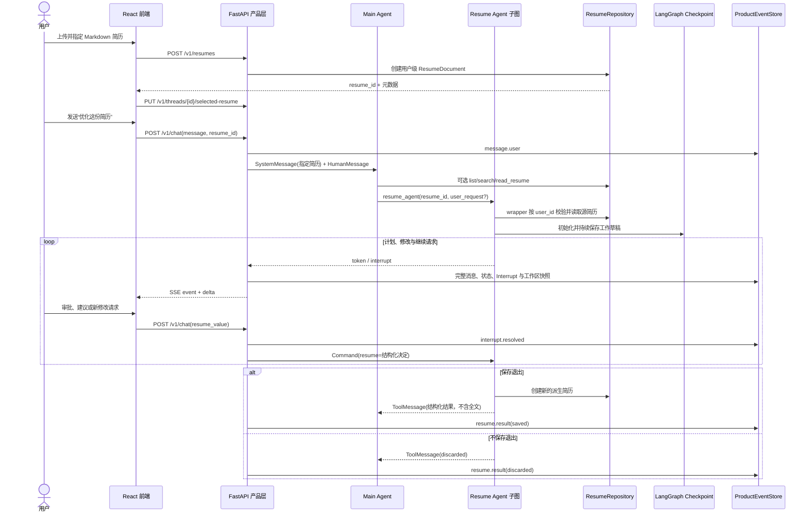
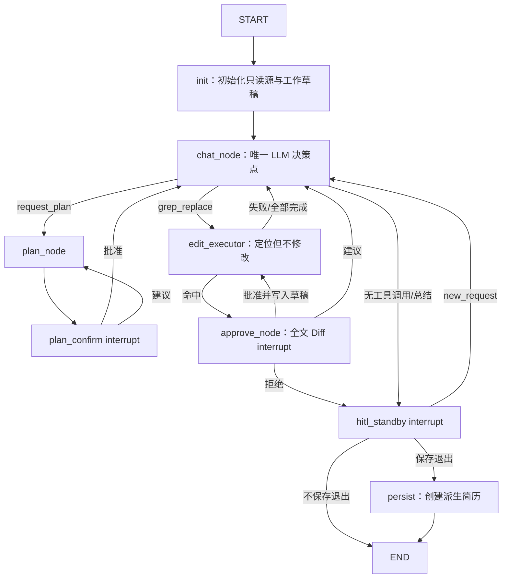

# 简历修改功能前后端数据流报告

> 目的：从用户故事出发，串联当前 React 前端、FastAPI 产品层、Main Agent、Resume Agent 子图、SQLite 资源库、产品事件时间线与 LangGraph checkpoint，便于逐段审查实现是否符合产品预期。

## 1. 当前功能定位

用户可以在一个持续的会话中：

1. 上传、查看、重命名、删除和指定 Markdown 简历；
2. 用自然语言要求 Main Agent 修改某份简历；
3. 由 Main Agent判断目标简历并调用 Resume Agent；
4. 在不刷新聊天时间线的情况下进入独立的 Resume Agent 常驻编辑会话；
5. 审阅修改计划、逐条批准或拒绝修改、提出调整建议；
6. 在 `hitl_standby` 继续提出新的修改要求；
7. 最终选择保存为一份新的派生简历，或者放弃整个工作草稿。

源简历始终只读。批准仅表示修改进入当前 checkpoint 工作草稿，不会覆盖源简历；只有“保存为新简历并退出”才会创建新的简历资源。

## 2. 两条互不替代的持久化链

### 2.1 图执行链：LangGraph checkpoint

LangGraph checkpoint 保存 Main Graph 与 Resume 子图的执行状态，包括：

- Main Agent 与 Resume Agent 的消息状态；
- 当前子图命名空间和下一节点；
- `resume_shot` 工作草稿；
- 已处理的修改项；
- 当前计划和 Interrupt；
- 保存或放弃意图。

图恢复只读取 checkpoint。任何产品事件都不会成为图输入。

### 2.2 产品展示链：产品事件时间线

产品事件用于恢复浏览器界面，包括：

- `message.user`：用户消息；
- `message.agent`：完整的可见 Agent 消息；
- `task.started/status/completed/interrupted/failed`：执行状态；
- `agent.transition`：Main/Resume Agent 交接；
- `tool.status`：工具完成状态；
- `interrupt.requested/resolved`：审批卡片和用户决策；
- `resume.result`：保存或放弃的最终结果；
- `citation.list`：知识问答实际采用的引用。

流式 token 作为临时 `delta` 发给浏览器，不逐 chunk 持久化；完整消息结束后才写入 `message.agent`。意外断线时未完成的 chunk 可以丢失。

checkpoint 重跑可能再次产生相似产品事件，前端按稳定事件 ID 和事件顺序原样展示，不做图级去重。

## 3. 总体数据流



## 4. 用户故事一：上传和管理简历

### 用户行为

用户点击聊天框旁的简历按钮，在列表窗口中拖入 `.md` 文件，也可以重命名、删除或选择一份简历。

### 前端数据流

主要入口：

- `frontend/src/ResumePicker.tsx`
- `frontend/src/api.ts`
- `frontend/src/App.tsx`

上传时浏览器读取文件文本，然后发送：

```json
POST /v1/resumes
{
  "original_name": "resume.md",
  "content": "# 简历正文"
}
```

后端返回完整 `ResumeDocument`，其中包含不可变的内部 `id`、原始名称、显示名称和正文。

选择简历时发送：

```json
PUT /v1/threads/{thread_id}/selected-resume
{
  "resume_id": "真实资源 ID"
}
```

### 后端数据流

接口位于 `src/server/app.py`：

- `POST /v1/resumes`：上传；
- `GET /v1/resumes`：元数据列表；
- `GET /v1/resumes/{resume_id}`：读取正文；
- `PATCH /v1/resumes/{resume_id}`：只修改显示名称；
- `DELETE /v1/resumes/{resume_id}`：删除；
- `GET /v1/resumes/{resume_id}/download`：下载 Markdown；
- `PUT /v1/threads/{thread_id}/selected-resume`：记录当前 Thread 的前端指定项。

资源实现位于 `src/kernel/resumes.py`。每次访问都带 `principal_id`，因此不同游客或开发人员之间相互隔离。

简历不会进入知识向量库。`search_resumes` 是对简历正文的独立关键词搜索，不会混入知识库结果。

## 5. 用户故事二：用户明确指定简历并要求修改

### 请求示例

用户在前端选中“0716_agent简历.md”，发送：

> 帮我强化这个项目的多智能体亮点。

### 浏览器到产品层

`frontend/src/api.ts::streamGraph` 发送：

```json
POST /v1/chat
{
  "thread_id": "thread-id",
  "message": "帮我强化这个项目的多智能体亮点。",
  "resume_id": "resume-id",
  "resume_value": null
}
```

后端首先验证 `resume_id` 属于当前用户，然后构造两条图输入消息：

1. `SystemMessage`：包含显示名称与真实 `resume_id`，并声明它只是高优先级上下文；
2. `HumanMessage`：用户原话。

同时写入 `message.user` 产品事件，事件 payload 会附带 `resumeId` 和 `resumeDisplayName`，用于前端在用户消息气泡中显示附件标记。

### 为什么不由后端直接调用 Resume Agent

前端指定不等于后端强制路由。Main Agent仍然可以结合用户最新自然语言判断：

- 用户是否真的要求修改；
- 用户是否在文字中改指另一份简历；
- 是否需要先读取正文；
- 是否应当询问一次入口级澄清。

这一行为由 `src/agents/main/prompts.py::SYSTEM_PROMPT` 明确规定。

## 6. 用户故事三：用户没有指定简历，或者请求模糊

### 请求示例 A

> 帮我修改最新的简历。

Main Agent可以调用 `list_resumes`，在没有歧义时优先考虑最近上传的简历。

### 请求示例 B

> 把我简历中的 InterviewAssistant 项目优化一下。

Main Agent可以调用 `search_resumes(query="InterviewAssistant")`，得到命中的 `resume_id` 和行级片段，再按需调用 `read_resume`。

### 请求示例 C

> 帮我优化简历。

如果有多份候选且无法可靠判断，Main Agent应询问用户。若没有任何简历，则提示用户通过聊天框简历入口上传 Markdown。

### Main Agent拥有的最小简历资源工具

实现位于 `src/agents/main/tools/resume_resources.py`：

| 工具 | 输入 | 返回 | 职责 |
|---|---|---|---|
| `list_resumes` | 无 | 元数据列表 | 查有哪些简历，不返回全文 |
| `search_resumes` | query、可选 resume_id | 行级关键词命中 | 按内容缩小候选范围 |
| `read_resume` | resume_id、行区间 | 受控正文 | 读取指定简历内容 |

这些工具都从 `RunnableConfig.configurable.user_id` 获取可信身份，不接受 LLM 自行提供用户 ID。

## 7. Main Agent到 Resume Agent 的交接

入口工具位于 `src/agents/main/tools/resume_agent.py`。

交接 schema 被精简为：

```json
{
  "resume_id": "必填、真实且已验证的资源 ID",
  "user_request": "可选，用户原话或忠实的简短概括"
}
```

不交接以下内容：

- 整份简历正文；
- Main Agent自行生成的完整修改计划；
- 强制填写的岗位、语气、范围等大量字段；
- 用户 ID 或 Thread ID。

`resume_agent_node` wrapper 从可信 `RunnableConfig` 读取 `user_id` 和 `thread_id`，再通过 `ResumeRepository.require(user_id, resume_id)` 验证归属并加载源简历。

wrapper 创建稳定的：

```text
resume_session_id = resume:{principal_id}:{thread_id}:{tool_call_id}
```

该 ID 用于保证 checkpoint 重跑和保存派生简历的幂等性。

如果 `user_request` 为空，Resume Agent以空消息进入，由它结合简历正文询问用户，而不是让 Main Agent为了填满 schema 连续追问。

## 8. Resume Agent图结构与状态流动

实现位于 `src/agents/resume/graph.py`。



### 8.1 `init_node`

wrapper 已经读取源简历并传入 `resume_shot`。`init_node` 初始化本次常驻会话需要的草稿、处理记录和输出状态。

### 8.2 `chat_node`

这是 Resume Agent唯一使用 LLM 作业务决策的节点。它看到：

- 当前完整 `resume_shot`；
- 当前计划；
- 用户请求或建议；
- 可选选区提示。

它可以：

- 调用一个或多个 `grep_replace`；
- 调用 `request_plan`；
- 不调用工具并输出总结，进入 `hitl_standby`。

### 8.3 逐条修改审批

一波多个 `grep_replace` 不会一次性全部写入草稿：

1. `edit_executor_node` 取第一个未处理项，只验证目标是否唯一命中；
2. 命中后进入 `approve_node`，构造完整 `before/after` 与局部 `before_text/after_text`；
3. 前端用完整版本做源码原位 Diff 和 Lapis渲染对比；
4. 用户批准后才调用 `_apply_grep_replace` 更新 `resume_shot`；
5. 再处理同一波的下一条修改。

批准后的修改不能逐条撤销，但用户仍可在最后放弃整个草稿。

### 8.4 `hitl_standby`

这是常驻会话的继续入口，不是强制退出节点。

- 用户通过聊天框发送新要求：

```json
{
  "action": "new_request",
  "request": "继续修改技能部分",
  "selection": "可选的工作区选中文本"
}
```

节点注入新的 `HumanMessage`，条件边返回 `chat_node`。

- 保存为新简历并退出：

```json
{"action": "exit", "save": true}
```

- 不保存并退出：

```json
{"action": "exit", "save": false}
```

只有 `hitl_standby` 前端才开放这两个退出按钮；聊天框仍保持可用。

## 9. Interrupt 的前后端协议

业务契约定义在 `src/kernel/contracts.py`。

### 9.1 计划确认

```json
{
  "phase": "plan_confirm",
  "plan": ["步骤一", "步骤二"]
}
```

前端返回 `approve` 或带建议的 `suggest`。

### 9.2 逐条修改审批

```json
{
  "phase": "resume_approve",
  "edit_id": "tool-call-id",
  "ordinal": 1,
  "total": 3,
  "section": "项目经历",
  "reason": "突出多智能体架构",
  "before_text": "局部原文",
  "after_text": "局部候选文本",
  "before": "修改前完整 Markdown",
  "after": "修改后完整 Markdown"
}
```

前端返回 `approve`、`reject` 或 `suggest`。

### 9.3 常驻待命

```json
{
  "phase": "resume_hitl",
  "summary": "本轮修改总结"
}
```

前端返回 `new_request` 或 `exit`。

### 9.4 恢复过程

浏览器把结构化决定放入 `/v1/chat` 的 `resume_value`。服务端检测到 checkpoint 中存在 pending Interrupt 后：

1. 写入 `interrupt.resolved` 产品事件；
2. 校验并规范化 payload；
3. 构造 `Command(resume=value)`；
4. 从准确的子图挂起点继续执行。

预期内的 `interrupt()` 将 Thread 状态记为 `waiting`，前端显示“待确认”，不会显示“上次执行已中断”。只有断线、主动停止或进程异常等非预期暂停才使用 `interrupted`。

## 10. 前端工作区如何恢复

主要代码：

- `frontend/src/interrupts.ts`
- `frontend/src/ResumeWorkspace.tsx`
- `frontend/src/App.tsx`
- `frontend/src/Timeline.tsx`

服务端在写入 `interrupt.requested` 时，从 checkpoint 读取只供展示的 workspace snapshot：

```json
{
  "resumeId": "源简历 ID",
  "displayName": "显示名称",
  "draft": "当前工作草稿 Markdown"
}
```

该 snapshot 只写产品事件，不反馈给图。

前端规则：

- `active_mode=resume`：工作区始终驻留；
- pending `resume_approve`：展示完整源码 Diff 和渲染前后对比；
- Interrupt 已解决、下一节点正在执行：继续使用最近快照；批准时临时显示候选 `after`；
- 新快照到达：替换工作区内容；
- `active_mode=chat`：Resume Agent已经保存或放弃退出，工作区关闭。

源码模式在完整 Markdown 原位置插入删除与新增标记。渲染对比中，“修改前”把删除内容标红，“修改后”把新增内容标绿。没有 Diff 时只显示当前草稿。

## 11. 保存与放弃的数据流

### 11.1 保存退出

`persist_node` 调用 `ResumeRepository.create_derived`：

- 不修改源简历；
- 创建新的 `resume_id`；
- 记录 `source_resume_id`；
- 使用稳定 derivation key 保证重复执行不会重复创建；
- 返回 `output_resume_id` 和显示名称。

Resume 子图结束后，wrapper 只向 Main Agent返回最小结构化 `ToolMessage`：

```json
{
  "source_resume_id": "源 ID",
  "output_resume_id": "新 ID",
  "outcome": "saved",
  "summary": "修改总结",
  "display_name": "新简历名称"
}
```

完整草稿不会塞回 Main Agent消息上下文。产品层识别这个 ToolMessage 后写入 `resume.result`，前端展示下载入口。

### 11.2 不保存退出

子图直接结束，不调用 `persist_node`，不会创建新资源。wrapper 返回 `outcome=discarded`，前端时间线显示本轮草稿已放弃。

## 12. Prompt 修改与当前约束

### 12.1 Main Agent Prompt

文件：`src/agents/main/prompts.py`

本轮新增或强化了：

1. 简历是用户级 Markdown 资源，不是 RAG 知识；
2. 只能使用前端上下文或工具返回的真实 `resume_id`；
3. 前端指定是高优先级提示，不是后端强制选择；
4. 未指定时使用 `list_resumes/search_resumes/read_resume`；
5. 多候选无法判断时询问用户；
6. 交接 Resume Agent只传 `resume_id + user_request?`；
7. Main Agent只做入口级澄清，不替 Resume Agent生成详细需求规格或计划。

### 12.2 Resume Agent Prompt

文件：`src/agents/resume/prompts.py`

当前 Prompt明确：

1. 每轮都注入当前完整工作草稿；
2. `grep_target` 必须从当前草稿原样复制并唯一命中；
3. `section/reason` 用于向用户解释，而不参与替换；
4. 简单修改直接 `grep_replace`；
5. 复杂或不确定时使用 `request_plan`；
6. 信息不足时先自然语言询问，不编造经历、岗位或成果；
7. 全部完成后不调用工具，输出总结进入 `hitl_standby`；
8. 已批准修改进入工作草稿且不可逐条回退，但整个草稿仍可放弃。

### 12.3 值得重点人工验证的 Prompt 行为

- “复杂修改必须 request_plan”是否过于刚性，导致不必要的计划确认；
- Main Agent对“最新简历”的判断是否稳定，是否需要更明确的排序说明；
- Resume Agent信息不足时是否真的先询问，而不是臆造修改；
- 一波生成多个 `grep_replace` 时，是否能提供清晰且真实的 `section/reason`；
- 用户拒绝一条后直接进入待命、终止本波剩余修改，是否符合预期；
- 用户在待命阶段继续提要求后，模型能否正确基于已经批准的草稿继续工作；
- 保存完成后的 Main Agent总结是否简洁，是否错误声称覆盖了源简历。

## 13. 建议的代码阅读顺序

1. `docs/阶段4-resume_agent职责的重划分.md`：产品职责决策；
2. `src/agents/main/prompts.py`：Main Agent选择和交接规则；
3. `src/agents/main/tools/resume_resources.py`：Main Agent查找简历；
4. `src/agents/main/tools/resume_agent.py`：wrapper 与最小交接；
5. `src/agents/resume/state.py`：子图状态；
6. `src/agents/resume/prompts.py`：Resume Agent决策约束；
7. `src/agents/resume/graph.py`：计划、逐条审批、待命和保存路由；
8. `src/kernel/contracts.py`：Interrupt 出入站结构；
9. `src/kernel/resumes.py`：资源隔离、搜索和派生保存；
10. `src/server/app.py`：HTTP、SSE、产品事件和 checkpoint 桥接；
11. `frontend/src/api.ts`：浏览器请求与 SSE 解码；
12. `frontend/src/interrupts.ts`：pending Interrupt 和工作区恢复；
13. `frontend/src/Timeline.tsx`：Agent消息与审批卡片；
14. `frontend/src/ResumeWorkspace.tsx`：源码 Diff 与 Lapis渲染对比；
15. `frontend/src/App.tsx`：整体页面状态与发送逻辑。

## 14. 验证清单

- [ ] 前端指定简历后，Main Agent仍有选择权，没有被后端强制路由；
- [ ] Main Agent不会编造 `resume_id`；
- [ ] 未指定简历时能正确 list/search/read；
- [ ] wrapper 按当前 principal 校验源简历归属；
- [ ] Resume Agent不覆盖源简历；
- [ ] 工作草稿只通过 checkpoint 驱动图执行；
- [ ] 产品事件没有被读取为图输入；
- [ ] 每条修改只有批准后才进入 `resume_shot`；
- [ ] 拒绝和建议的路由符合预期；
- [ ] `hitl_standby` 可以继续聊天，也可以选择退出；
- [ ] 工作区在整个 Resume Agent会话中保持驻留；
- [ ] 保存退出只创建一份幂等派生简历；
- [ ] 不保存退出不会创建新简历；
- [ ] 刷新后审批卡片和工作区可由产品事件恢复；
- [ ] 正常 Interrupt 显示“待确认”，不显示异常中断恢复提示。
